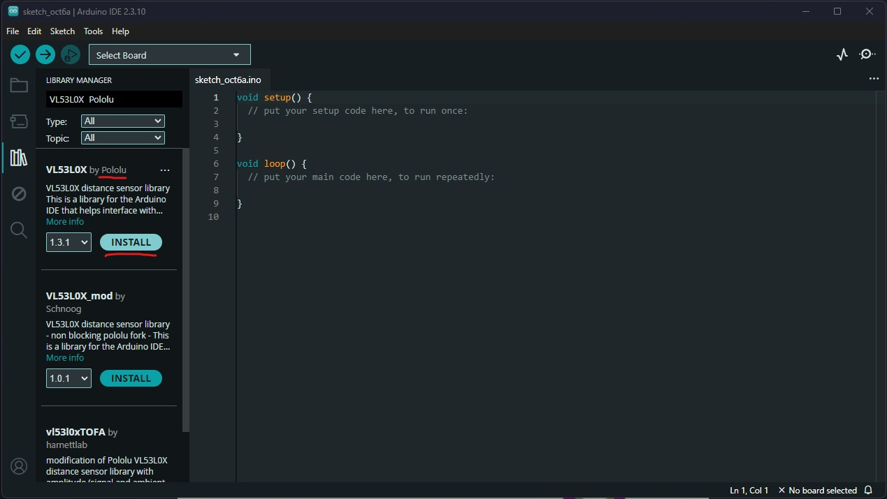

# Distance-Monitor-Project

**We used a VL53L0X time-of-fight sensor and an Arduino Nano to monitor distance in real time.**

"ToF sensors use a tiny laser to fire out infrared light where the light produced will bounce off any object and return to the sensor. Based on the time difference between the emission of the light and its return to the sensor after being reflected by an object, the sensor is able to measure the distance between the object and the sensor."

## Hardware

Take a look at the VL53L0X Pinout:

1. Start connecting the Arduino Nano to the breadboard like so:

2. Once the Nano is properly seated on the breadboard, give it power by connecting it the laptop via the USB (laptop) -> USB Type C (Nano).
3. Connect the VL53L0X to the breadboard like so:

5. Use the male-to-male jumper cables to connect the Nano to the VL53L0X. The connections between the two is as follows:

| Arduino Nano | VL53L0X |
| ------------ | ------- |
| 5V           | VIN     |
| GND          | GND     |
| A5           | SCL     |
| A4           | SDA     |

#### You should now be ready to continue to the software set-up.

## Software

### Downloading the Arduino IDE

1. Go to https://www.arduino.cc/en/software/
2. Download the IDE and go through the set-up process.

> **Make sure you allow the IDE to access to the USB bus. It will not recognize the Arduino Nano if you don't.**

### Downloading the VL53L0X Library by Pololu

1. Go to the library manager in the Arduino IDE.

### Once the library is downloaded, you should be ready to upload the source code (Time-of-Flight-Source.ino) into the IDE.

## Sources
ToF explanation: https://www.seeedstudio.com/blog/2020/01/08/what-is-a-time-of-flight-sensor-and-how-does-a-tof-sensor-work/  
Diagrams: https://electrocredible.com/vl53l0x-arduino-measure-distance-time-of-flight-sensor/ 
